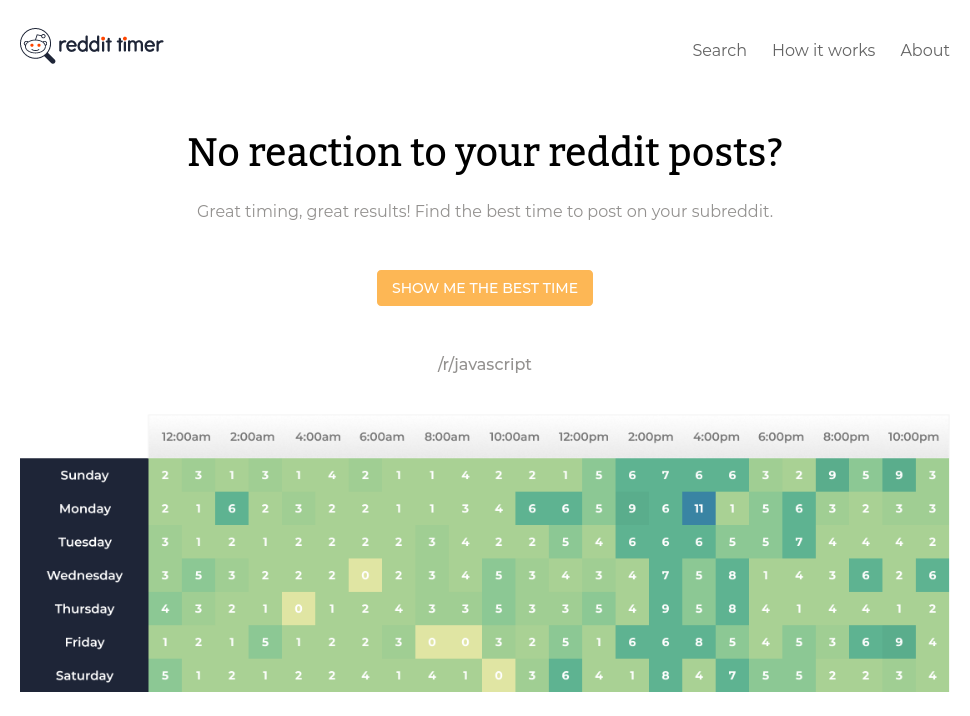

<h1 align="center">Reddit Timer App</h1>

<p align="center">
  Reddit Timer finds the best time to post on a subreddit by fetching the top 500 posts from a subreddit you provide and displaying those posts within a weekday heatmap, where posts are sorted into hours based on their creation time.
</p>

<p align="center">
  <a href="https://dcwds-reddittimer.netlify.app">View the app on Netlify</a><br />

  <a href="https://app.netlify.com/sites/dcwds-reddittimer/deploys">
    
  </a>
</p>

<p align="center">
  <a href="https://dcwds-reddittimer.netlify.app">
    
  </a>
</p>

## About
The project is available in one of the courses by [Profy.dev](https://profy.dev). The course leaves the tech stack and implementation details up to the developer and simulates _real-world_ workflows through GitHub, [ClickUp](https://clickup.com) (a Kanban board), and [Figma](https://figma.com).

Tasks are broken up into user story acceptance criteria and designs can be referenced through shared Figma files. Pull requests are created per task and are often reviewed by [Johannes Kettmann](https://jkettmann.com), a senior full-stack developer and creator of [Profy.dev](https://profy.dev).

## What I Learned
- [Test use cases.](https://kentcdodds.com/blog/how-to-know-what-to-test) I wrote some [E2E tests for the subreddit search page](src/components/page-search/page-search.test.js).
- Use [Mock Service Worker](https://mswjs.io) to create [handlers that return mocked responses](src/__mocks__/handlers.js) for use in testing.
- Asynchronous tests are tricky. Tests can timeout before execution has finished, requiring the developer to [set the `timeout` duration themselves](src/components/page-search/page-search.test.js).
- Days and hours can be represented with numbers and it's important to notice this because it [simplifies a number of operations around that data](src/hooks/use-fetch-posts/use-fetch-posts.js).
- [CSS grid](https://developer.mozilla.org/en-US/docs/Web/CSS/grid) can sometimes be a more favorable option over [CSS flex](https://developer.mozilla.org/en-US/docs/Web/CSS/flex). Both the [heatmap](src/components/page-search/heatmap.style.js) and [posts table](src/components/page-search/posts-table.style.js) use CSS grids.
- Use GitHub's commenting tools within a context of a pull request to discuss potential solutions inline.

## Tech Stack
- Bootstrapped with [Create React App](https://create-react-app.dev/)
- Styles with [Styled Components](https://styled-components.com/)
- Routing with [React Router](https://reactrouter.com/)
- Testing tools with [Testing Library](https://testing-library.com/)
- API mocking with [Mock Service Worker](https://mswjs.io)

## Usage
```sh
# Install dependencies
$ yarn install

# Start dev server at localhost:3000
$ yarn start

# Build for prod
$ yarn build

# Start test runner
$ yarn test
```
